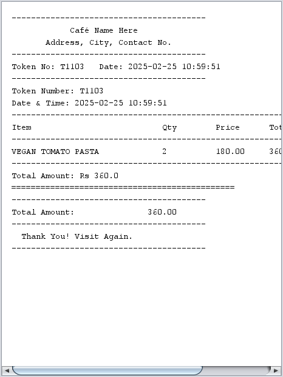

# CafeOrderSystem
Java Swing Café Ordering System – A desktop application for adding, removing, and managing food orders using a simple GUI.

## Project Screenshot

## Features
- Add, update, and delete food orders
- Manage menu with images
- Simple and user-friendly GUI

## Technologies Used
- Java
- Swing (GUI)
- NetBeans IDE
